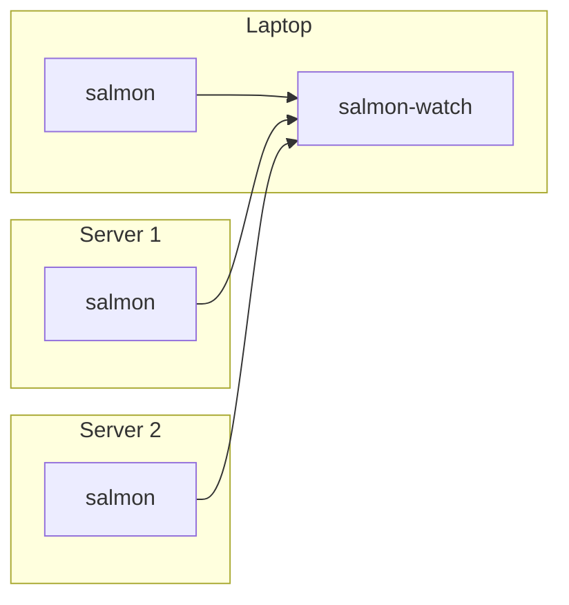

# Salmon: desktop alerts and a tray icon for failing systemd services and anything else

Salmon is a simple monitoring utility which checks the health of your local
machine and/or remote server(s), and helps you notice timely if something is
wrong.


## Project history and naming

I use [Syncthing](https://syncthing.net/) to sync important data across multiple
machines. It works so well so after I've set it up, after some time I obviously
just got used to it working all the time. And then one day I noticed that
apparently some stuff didn't get synced. So I checked around, and found out that
the Syncthing systemd service got broken a couple weeks ago for some reason,
without me noticing it, and so nothing was synced during this time. That was
really annoying: it means that the synced data on the machines that I use could
have get diverged if I changed it on both of them, and if it's binary data, then
merging the changes will likely be a challenge.

And what's even more annoying is that an incident like a systemd service failure
totally should have been communicated to me somehow, and yet I didn't know about
it until I noticed a side effect of this failure.

It wasn't the first time when I got frustrated about the OS being too silent
about failures like that (both locally and on the servers), and so after this
Syncthing incident, I finally resolved to implement a utility which would help
me notice systemd service failures, at least by showing a simple icon in tray,
just like a green/red dot.

So the first idea was to make it sort of "systemd monitoring". However, after a
short while I realized that I actually want to reuse the same tray icon for
monitoring things other than systemd services; a trivial example is to just
check if we're not running out of disk space. Most desktop environments do
perform this check for us, but when it comes to the servers, we're on our own;
and it happened to me multiple times in the past that a server runs out of disk
space and it takes a while to find that out and fix. So the next idea was, in
addition to monitoring systemd services health, to also support running some
arbitrary command periodically, and notify when the exit code is not what we
want. This way, we can implement "polling" of literally anything that can be
checked from the shell. This check is not as realtime as with systemd, since we
probably shouldn't poll things more frequently than once per minute, but for
things like checking disk space, it should be good enough.

Anyway, so then the name became something like "systemd et al monitoring".
Which, if I take some random letters out of it: "Systemd et AL MONitoring",
becomes "salmon".

## Overview

This project has two main parts:

  * `salmon`, a background service: runs on a machine, checks its health, and
    serves the current incidents via simple read-only WebSocket API;
  * `salmon-watch`, a desktop app: connects to one or more `salmon`s, receives
    data from them, shows a tray icon, sends desktop notifications, and
    provides a local web UI.

So `salmon` is a server (which can run locally too), and `salmon-watch` is a
client which runs on e.g. a laptop. If we have a laptop and two servers, a
typical setup looks like this:



Salmon reports incidents, each of them has:

- A key, like `systemd.my-service` or `free-space.exec-result`
- A state: `warning` or `error`

These incidents are generated accordingly to the Salmon configuration. For details
on that, see [Configuring Salmon](./docs/salmon_config.md).

Salmon-Watch combines these incidents. For each incident, it also prefixes the
keys with the ID for that particular Salmon like `my-server` (that you specify
in the Salmon-Watch config) so the key becomes like
`my-server.systemd.myservice`.

For details about Salmon-Watch configuration, see
[Configuring Salmon-Watch](./docs/salmon_watch_config.md).

If an incident happens and we want to just acknowledge it but worry about it
later, we can snooze it in the web UI, so the icon stops being annoying but
it'll get unsnoozed again later.

The tray icon shows the worst current non-snoozed state:

  * Gray: the initial state isn't known yet;
  * Green: everything is OK;
  * Magenta blinking: Salmon-Watch itself has an internal connection or tunnel error;
  * Yellow blinking: at least one warning;
  * Red blinking: at least one error.

## Installation Quick Start (Linux)

### Monitoring local machine

The easiest way to install both `salmon` and `salmon-watch` to monitor local
machine health is as follows:

First, download the [latest prebuilt binaries from GitHub](https://github.com/dimonomid/salmon/releases/tag/v1.0.0),
like `salmon_1.0.0_linux_amd64.tar.gz` and `salmon-watch_1.0.0_linux_amd64.tar.gz`,
and unpack them. You'll get two binaries: `salmon` and `salmon-watch`.

Then:

```bash
# Install both binaries system-wide:
sudo install -m 755 salmon /usr/local/bin/salmon
sudo install -m 755 salmon-watch /usr/local/bin/salmon-watch

# Let it create default configs, systemd service, desktop autostart entry,
# and application launcher.
sudo salmon setup
salmon-watch setup

# Start both:
sudo systemctl start salmon.service
salmon-watch
```

You should now see a tray icon, and if you click on it and then Status, you'll
see the web interface. When you reboot, it will start automatically.

### Monitoring remote machines

If you have e.g. a personal server which you also want to monitor using the
same interface on your desktop, then on each such remote machine follow the
same steps as above, but only for `salmon` (no need to install `salmon-watch`
on the servers).

Having `salmon` running on your server, we need to point our local
`salmon-watch` to it, which by default only listens on 127.0.0.1 (so we can't
reach it directly from a laptop).

Presumably you have ssh access to your server with public key authentication
(i.e. you can ssh there without a password), so the easiest way forward here is
to establish an ssh tunnel, and `salmon-watch` has a convenient support for it:
open the config file `~/.config/salmon-watch/salmon-watch.yml`, and add one
more entry to the `wsClient.servers` array, like that (adjusting at least your
server hostname and username):

```yaml
    - id: myserver # Arbitrary but unique ID for this server.
      addr: localhost:41991   # Just any available port on the local machine
      tunnel:
        ssh:
          host: myserver.com  # TODO: your actual server hostname
          user: myuser        # TODO: your actual ssh user
          port: 22            # Change if using non-default ssh port
          remoteSalmonAddr: 127.0.0.1:41990
```

And restart `salmon-watch`. Open its web UI and verify that the list of servers
now includes your newly added remote server as well.

SSH tunnel is not the only way to access remote servers; salmon also supports
TLS and bearer token authentication. For details, see docs on
[Security](./docs/security.md).

## Configuration

The default config (which `sudo salmon setup` writes to `/etc/salmon.yml`) is
as follows: if any systemd service is failing, it's a warning (the tray icon
will be blinking yellow). If there's less than 100 MiB of free space in the
root partition, it's an error (the tray icon will be blinking red). Otherwise,
it's all good (the tray icon is green).

The config includes comments and examples, so take a look and experiment with
it; and also check the [Configuring Salmon](./docs/salmon_config.md) docs. For
instance, I like to explicitly list services I particularly care about, such as
Syncthing, and configure any state other than `active` as an error rather than
a warning. That includes services stopped manually - if it was manually stopped
for some reason, I want to be annoyed by the blinking icon until the service is
running again. And I have some more custom exec checks as well.

Don't forget to restart the salmon systemd service to apply the changes.

## Non-Linux OS support

So far Salmon was only tested on Linux. The tray icon library is crossplatform
and is known to work on Windows and MacOS, so there's nothing preventing
`salmon-watch` from working on these OSes, and you can run it there and monitor
your remote Linux servers, but not so much the local machine.

Even `salmon` can technically run on non-Linux, but obviously the `systemd` is
irrelevant there, and then the only useful check there is `exec`: just polling
some script periodically, so we lose the out-of-the-box system-wide system
service monitoring, and thus the usefulness is limited.  Would be cool to
implement systemd-like checks for Windows and MacOS, but I don't use these so
hard to test. PRs are welcome.

## Development

### Building

You need [Go](https://go.dev/) 1.26.

For `salmon-watch`, you also need some UI-related libraries, which on Ubuntu
can be installed like this:

```
sudo apt-get install -y gcc libgtk-3-dev libayatana-appindicator3-dev
```

Having that, to build both `salmon` and `salmon-watch`:

```
make
```

To build only one of them:

```
make salmon
make salmon-watch
```

### Running tests

Same requirements as for building.

```
make test
```

## Documentation

- [Configuring Salmon](./docs/salmon_config.md)
- [Configuring Salmon-Watch](./docs/salmon_watch_config.md)
- [Security](./docs/security.md)
